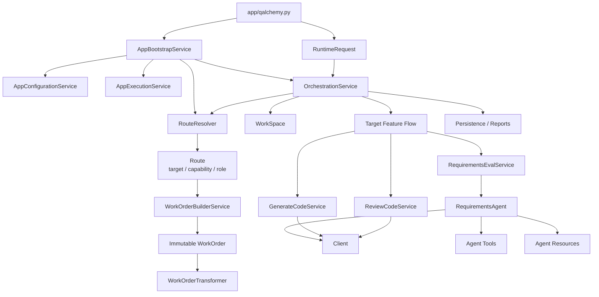
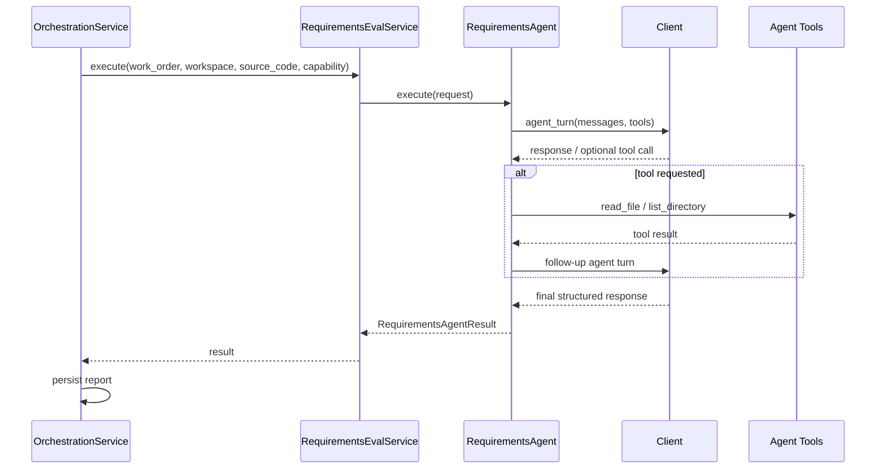

# QAlchemy Architecture

## Purpose

QAlchemy is a Python-based engineering application that provides reusable, service-oriented workflows around engineering tasks such as code generation, code review, and requirements evaluation.

This document describes the **current V1.3 implementation in the repository**. It intentionally separates implemented behavior from known limitations and future direction.

---

## V1.3 Architecture at a Glance



### Architectural responsibility

| Component | Primary responsibility |
|---|---|
| CLI | Collect user input and create the runtime request |
| RuntimeRequest | Carry request parameters into the application |
| RouteResolver | Use the configured model to determine canonical target, capability, and role |
| Route | Immutable routing decision |
| WorkOrderBuilderService | Convert request + route into the canonical WorkOrder |
| WorkOrder | Immutable execution contract |
| OrchestrationService | Coordinate routing, WorkOrder creation, workspace lifecycle, feature dispatch, and persistence decisions |
| Feature Services | Perform feature-specific application work |
| RequirementsAgent | Execute the current tool-enabled requirements workflow |
| Client | Provide the provider/model boundary |
| Tools | Perform deterministic operations requested by the Agent |
| Resources | Provide role, protocol, standards, templates, and other Agent guidance |
| Persistence utilities | Write work orders, reports, and generated artifacts |

---

## Runtime Flow

The current end-to-end flow is:

```text
CLI
 │
 ▼
RuntimeRequest
 │
 ▼
OrchestrationService
 │
 ▼
RouteResolver
 │
 ▼
Route(target, capability, role)
 │
 ▼
WorkOrderBuilderService
 │
 ▼
WorkOrder
 │
 ├──────────────► persisted WorkOrder
 │
 ▼
WorkSpace
 │
 ▼
Target Feature Flow
 │
 ├── Generate Code
 ├── Review Code
 └── Requirements Evaluation
          │
          ▼
   RequirementsAgent
          │
          ├── Client / LLM
          ├── Agent Resources
          └── Agent Tools
          │
          ▼
   Structured Result / Report
          │
          ▼
       Persistence
```

### Runtime sequence

1. `app/qalchemy.py` parses CLI arguments and creates a `RuntimeRequest`.
2. `AppBootstrapService` loads configuration and creates the application services.
3. `OrchestrationService.execute()` asks `RouteResolver` to determine the route.
4. `RouteResolver` sends the routing request to the configured model and validates the returned JSON.
5. `WorkOrderBuilderService` builds the immutable `WorkOrder` from the request and resolved route.
6. The orchestrator creates the per-work-order workspace and persists the initial WorkOrder artifacts.
7. The orchestrator dispatches the resolved capability to the appropriate feature flow.
8. The feature flow performs the requested work.
9. The current Requirements flow may invoke the tool-enabled `RequirementsAgent`.
10. Results and reports are persisted according to the current feature/orchestration boundary.
11. The orchestrator completes the WorkOrder state and returns the structured result.

---

# Core Runtime Contracts

## RuntimeRequest

`RuntimeRequest` is the transport object created from CLI arguments.

Current fields:

```text
task: str
role: Path | None
target: str
deliverable: Path
source_code: list[Path]
references: list[Path]
```

`RuntimeRequest` intentionally remains lightweight. It carries paths and request information; it does not own file-content loading.

**Important V1.3 behavior:** `role` and `target` are request fields, but routing is authoritative for the execution route. The resolved `Route` supplies the role and target used to build the WorkOrder.

Source:

```text
scripts/core/runtime_request.py
```

---

## Route

`RouteResolver` produces the canonical routing decision:

```python
Route(
    target: str,
    capability: str,
    role: str,
)
```

The current canonical targets are:

```text
generate_code
review_code
requirements
```

Current capability vocabulary includes:

```text
generate_code
review_code
evaluate
generate
refine
create_acceptance_criteria
create_test_cases
```

The requirements capabilities are currently represented under the `requirements` target.

The resolver requires the model response to contain exactly the routing fields needed by the application, validates the JSON, and returns an immutable `Route`.

### Routing responsibility

```text
Request context
    │
    ▼
RouteResolver
    │
    ├── target
    ├── capability
    └── role
    │
    ▼
Route
```

`RouteResolver` is **not an Agent**. It uses the configured model for classification, but it does not execute a multi-turn tool-driven Agent workflow.

Source:

```text
scripts/utils/route_resolver.py
```

---

## WorkOrder

`WorkOrder` is the immutable execution contract used across the application.

Current fields:

```text
task: str
role: str
target: str
deliverable: str
references: str = ""
```

The WorkOrder is assembled from:

```text
RuntimeRequest + Route
        │
        ▼
WorkOrderBuilderService
        │
        ▼
WorkOrder
```

The WorkOrder represents the organized execution request. It does not own provider configuration, persistence, or Agent implementation details.

Source:

```text
scripts/core/work_order.py
```

---

# Application Layers

## 1. Application Entry

### `app/qalchemy.py`

Responsibilities:

- Parse CLI arguments.
- Construct `RuntimeRequest`.
- Bootstrap the application.
- Dispatch execution to `OrchestrationService`.

The CLI contains no feature workflow logic.

---

## 2. Composition Root

### `services/app/app_bootstrap_service.py`

`AppBootstrapService` is the application composition root.

It:

- loads `config/app.yaml`;
- creates the client infrastructure;
- creates the current `RequirementsAgent`;
- creates Agent tools/resources required by that workflow;
- creates `RouteResolver`;
- creates feature services;
- initializes logging and exception infrastructure;
- creates `AppExecutionService`;
- creates `OrchestrationService` with its dependencies.

The bootstrap layer wires components; it does not implement feature behavior.

---

## 3. Shared Runtime Context

### `services/app/app_execution_service.py`

`AppExecutionService` exposes common application services needed by feature execution.

Current shared services include:

- `AppConfigurationService`
- `ClientService`
- `LoggerService`
- `ExceptionHandlingService`

It does not contain feature business logic.

---

# Orchestration

## `services/app/orchestration_service.py`

`OrchestrationService` is the central workflow coordinator.

It currently owns or coordinates:

- route resolution;
- WorkOrder construction;
- WorkOrder ID generation;
- workspace creation;
- initial WorkOrder persistence;
- feature dispatch;
- requirements report persistence;
- review report persistence;
- final WorkOrder completion/persistence.

### Current routing behavior

```text
Route.capability
       │
       ├── review_code ─────► ReviewCodeService
       │
       ├── evaluate ────────► RequirementsEvalService
       │
       └── generate_code ───► GenerateCodeService
```

The routing infrastructure supports a broader capability vocabulary than the currently implemented downstream execution paths.

That distinction is intentional and important:

> **A capability being recognized by RouteResolver does not mean that a complete downstream workflow for that capability is implemented.**

V1.3 has fully demonstrated the `requirements / evaluate` path. Other routes have existing feature infrastructure but do not yet have the same Agent-level coverage.

---

# Feature Services

## Generate Code

### `services/feature/generate_code_service.py`

The Generate Code feature currently:

- consumes the WorkOrder;
- transforms the WorkOrder into an execution prompt;
- invokes the configured client;
- normalizes the provider response;
- creates generated artifacts;
- writes generated artifacts into the work-order workspace output.

The feature currently performs artifact persistence directly. This is a known boundary difference from the preferred orchestration ownership model.

---

## Review Code

### `services/feature/review_code_service.py`

The Review Code feature currently:

- resolves supplied source files;
- preprocesses source content;
- builds the review prompt;
- invokes the configured client;
- renders the review result;
- returns rendered markdown for orchestration to persist.

This flow is closer to the preferred feature/persistence boundary.

---

## Requirements Evaluation

### `services/feature/requirements_eval_service.py`

The Requirements Evaluation feature currently:

- receives the WorkOrder and resolved capability;
- prepares the Agent execution request;
- invokes `RequirementsAgent`;
- receives a typed `RequirementsAgentResult`;
- returns the result to the orchestrator.

The orchestrator persists the requirements evaluation report in the WorkSpace.

---

# Current Agent Architecture

## RequirementsAgent

### `agents/requirements_agent.py`

V1.3 contains one implemented Agent workflow: `RequirementsAgent`.

It is deliberately more capable than a simple single model call.

The Agent:

- builds an execution prompt from Agent instructions, role/resources, protocol, and WorkOrder context;
- sends an Agent turn through the shared `Client`;
- allows the model to request approved tools;
- executes requested tools;
- returns tool results to the model;
- continues until the model produces its final structured response;
- validates and converts the final response into `RequirementsAgentResult`.

### Current Agent flow



### Agent resources

The current Requirements Agent uses external resources under the `agents` tree, including:

```text
agents/
├── protocols/
├── roles/
├── standards/
├── tools/
└── templates/
```

The Agent is therefore not dependent solely on Python code for its domain guidance.

### Agent tools

The current workflow exposes deterministic tools including:

- `read_file`
- `list_directory`

These allow the Agent to inspect project-level input and supporting resources during execution.

---

# Requirements Result Contract

### `agents/contracts/res_agent_results.py`

The Requirements Agent returns a strongly typed `RequirementsAgentResult`.

The current contract contains:

```text
role
capability
status
summary
findings
readiness
recommended_actions
confidence
report
```

The result is returned from the Requirements Agent through the Requirements feature service to the orchestrator.

The report is persisted as a WorkSpace output artifact.

---

# Client and Provider Boundary

## `clients/client.py`

The Client is the application boundary between QAlchemy and the configured model provider.

Current operations include:

```text
generate(prompt) -> str
agent_turn(messages, tools) -> AgentResponse
```

The current provider implementation is Ollama.

The Client owns provider/model interaction, timeout behavior, streaming behavior, and provider-specific message/tool adaptation.

The Client does **not** own routing logic or Agent domain behavior.

---

# Configuration

## `config/app.yaml`

Application configuration is loaded through:

```text
services/app/app_configuration_service.py
```

Current configuration areas include:

- application metadata;
- client/provider configuration;
- WorkOrder behavior;
- workspace paths;
- templates;
- reports;
- logging;
- exceptions.

Configuration supplies runtime/environment behavior. Agent domain guidance is supplied through Agent resources.

---

# WorkOrder Transformation

`WorkOrderTransformer` converts the canonical WorkOrder into execution-oriented text.

The current execution rendering includes:

```text
TASK
ROLE
TARGET
CAPABILITY
INPUT CONTENT
DELIVERABLE
REFERENCES
```

The transformer is responsible for presentation of the execution contract to the model. It does not own routing or persistence.

---

# Workspace and Persistence

Each execution creates a WorkSpace for the WorkOrder.

A representative successful V1.3 execution produces:

```text
work_orders/
└── <work-order-id>.md

work_space/
└── <work-order-id>/
    ├── <role-file>.md
    ├── <deliverable-file>
    ├── <work-order-id>.md
    └── output/
        └── <feature output>
```

For the demonstrated Requirements workflow, the output includes:

```text
output/
└── requirements_evaluation_report.md
```

The WorkOrder may also be persisted in the configured persistent WorkOrder directory when persistence is enabled.

macOS `.DS_Store` files are operating-system metadata and are not application artifacts.

---

# Logging and Exception Handling

## Logging

QAlchemy currently includes:

- standard Python logging;
- `LogEntry`;
- `Logger`;
- `LoggerConfig`;
- `LoggerService`.

Logging infrastructure is present and integrated into important services, but the application does not yet claim a fully uniform lifecycle logging policy across every workflow boundary.

## Exception Handling

QAlchemy includes:

- `ExceptionCatalog`;
- `QAlchemyException`;
- `ExceptionHandlingService`.

Exception infrastructure is wired into the application, but user-facing translation/enrichment is not yet uniformly applied to every runtime failure path.

These are implementation hardening areas rather than blockers to the demonstrated V1.3 Agent workflow.

---

# Current Architectural Boundaries

## Implemented and demonstrated

- CLI request creation.
- Application bootstrap and dependency wiring.
- Route resolution through the configured model.
- Canonical immutable Route.
- Canonical immutable WorkOrder.
- WorkOrder transformation.
- WorkSpace creation.
- Requirements feature execution.
- Tool-enabled Requirements Agent execution.
- Structured Requirements Agent result.
- Requirements report generation.
- WorkOrder and report persistence.
- Real CLI end-to-end execution.
- Automated regression coverage.

## Current limitations

- Only the Requirements workflow currently has a complete Agent implementation.
- RouteResolver recognizes a broader routing vocabulary than has been fully exercised end-to-end.
- Generate Code still owns generated-artifact persistence.
- Logging and exception handling are not yet completely uniform across every workflow boundary.
- Route determination currently uses the model for classification; the routing contract is validated by Python, but broader routing coverage remains an area for V1.4.

---

# Architectural Principles

### Orchestration

Owns workflow coordination and lifecycle decisions.

### Feature Services

Own feature-specific processing and creation of feature results.

### Agents

Own reasoning, interpretation, controlled decision-making, and tool-driven work within the execution context supplied to them.

### Tools

Own deterministic technical operations such as filesystem access.

### Client

Owns the provider/model integration boundary.

### WorkOrder

Remains the immutable execution contract.

### Agent Resources

Provide external guidance such as roles, protocols, standards, and templates rather than embedding all domain behavior in Agent code.

---

# V1.3 Verified Execution

V1.3 has been verified through a real CLI execution using a Jira requirement.

The demonstrated flow was:

```text
Jira Requirement Input
        │
        ▼
CLI
        │
        ▼
RuntimeRequest
        │
        ▼
RouteResolver
        │
        ▼
requirements / evaluate / business_analyst
        │
        ▼
WorkOrder
        │
        ▼
Requirements Evaluation Feature
        │
        ▼
RequirementsAgent
        │
        ├── Agent resources
        ├── Project input files
        └── ReadFileTool
        │
        ▼
RequirementsAgentResult
        │
        ▼
Requirements Evaluation Report
```

The resulting execution produced a WorkOrder, WorkSpace, selected role resource, copied deliverable, and persisted requirements evaluation report.

The full automated test suite also passes at the V1.3 freeze point.

---

# V1.3 Scope Boundary

V1.3 establishes the Agent workflow foundation. It does **not** attempt to solve the complete routing or generalized Agent problem.

The following are intentionally deferred:

- generalized QAlchemy Agent runtime;
- broader routing coverage;
- capability-specific Agent instruction resolution;
- large routing matrices;
- additional specialized Agents;
- broad requirements capability implementation;
- generalized Agent scaling architecture.

These belong to future iterations, beginning with V1.4.

---

# V1.4 Direction

The planned direction is intentionally lightweight.

The first objective is to evolve the proven Requirements Agent into a generic **QAlchemy Agent** rather than creating a collection of specialized Agents.

The intended model is:

```text
Task + Input + Deliverable
            │
            ▼
       RouteResolver
            │
            ▼
     Role / Capability / Target
            │
            ▼
      Feature Service
            │
            ├── resolve Agent instructions
            ├── resolve role/resources
            ├── resolve protocol/templates
            └── assemble execution context
            │
            ▼
       QAlchemy Agent
            │
            ▼
           LLM
```

A single `agent_instructions.md` may contain capability-oriented sections such as Requirements, Coding, and Test Cases when the instruction set remains small enough to manage coherently.

The WorkOrder remains the execution contract. The Feature Service prepares the Agent's operating context from the resolved route and external resources.

Initial V1.4 focus:

- simplify the current Requirements Agent into a generic Agent;
- mature RouteResolver using realistic Task + Input + Deliverable context;
- keep the role set small and resource-driven;
- expand Requirements-oriented capabilities;
- begin file-driven Test Case generation;
- avoid a large routing taxonomy or unnecessary resource/file proliferation.

---

# Guidance for AI Engineering Assistants

When modifying QAlchemy:

1. Treat this document as the current V1.3 architecture baseline.
2. Distinguish implemented behavior from future architecture.
3. Do not treat a recognized route as proof that its downstream workflow is implemented.
4. Preserve the immutable WorkOrder unless an approved architecture change requires otherwise.
5. Keep orchestration, feature execution, Agent reasoning, tools, and persistence responsibilities separated.
6. Do not move feature business logic into low-level utilities.
7. Prefer external Agent resources for domain guidance when that behavior does not need to be deterministic Python logic.
8. Review service ownership before introducing new dependencies or responsibilities.
9. Update tests and this architecture document when approved implementation behavior changes.
10. Keep V1.3 frozen unless a change is explicitly required for V1.3 maintenance.

---

# V1.3 Baseline Summary

```text
                    QAlchemy V1.3
                         │
                         ▼
                 RuntimeRequest
                         │
                         ▼
                  RouteResolver
                         │
                         ▼
                       Route
                         │
                         ▼
                    WorkOrder
                         │
                         ▼
                Feature Execution
                         │
             ┌───────────┴───────────┐
             │                       │
      Existing Services       Requirements Agent
             │                       │
             │                ┌──────┴──────┐
             │                │             │
             │              Tools       Resources
             │                │             │
             └────────────────┴──────┬──────┘
                                     │
                                     ▼
                              Structured Result
                                     │
                                     ▼
                              Workspace / Output
```

**V1.3 is the proven Agent workflow foundation. V1.4 is where the Agent, routing, roles, and externally driven capability content are generalized.**
