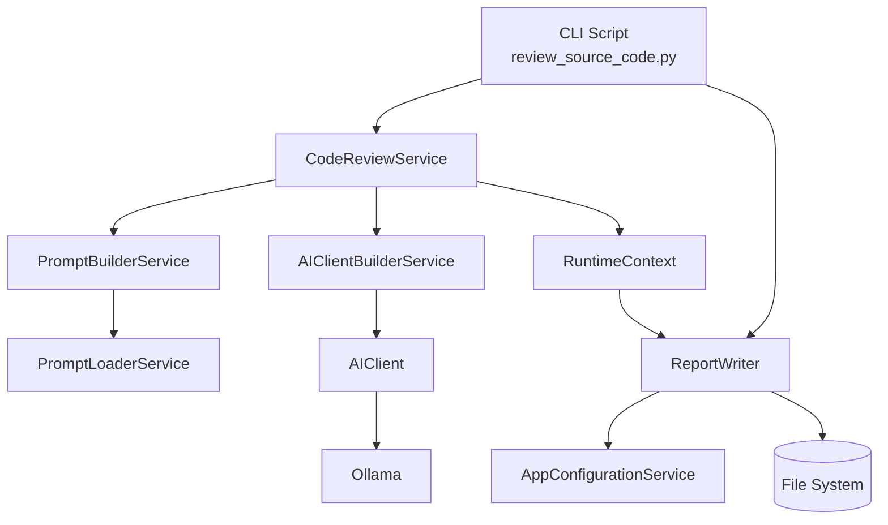
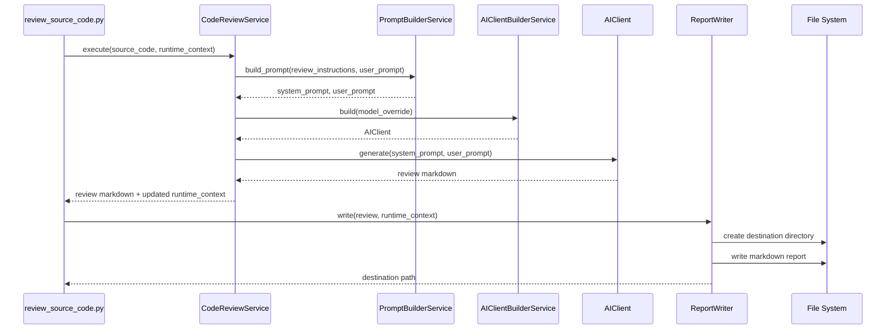
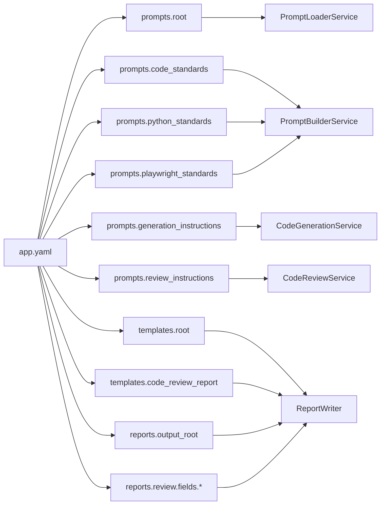

## Component: `ai/reporting.py` (`ReportWriter`)

## Architecture Overview

## Report Generation Sequence

### Purpose
Formats and persists Markdown review reports to disk.

### Responsibilities
- Load report template from framework configuration.
- Build review metadata table (source file, model, execution time).
- Render final Markdown report content.
- Ensure destination directory exists.
- Write report file and return output path.

### Upstream Dependencies (Who calls this)
- Main review orchestration/service layer (caller passes `review`, `source_file`, `destination`, `model`, `execution_time`).
- Any workflow that needs persisted AI review output.

### Downstream Dependencies (What this component uses)
- `services.app_configuration_service.AppConfigurationService`
  - Reads:
    - `reports.review.template`
    - `reports.review.fields.*`
- `pathlib.Path`
  - Reads template file.
  - Creates destination directories.
  - Writes report files.

### Data Flow
`Review Content + Metadata -> ReportWriter -> Markdown Render -> File System -> Report Path`

### Current Notes
- `lines_reviewed` and `review_date` are implemented in `_build_review_information` and controlled by `reports.review.fields`.

## Configuration Mapping

