# Version >= 1.1

# QAlchemy Architecture

---

# Purpose

Provide a high-level architectural view of the QAlchemy application.

This document describes the application's organization, runtime architecture, startup lifecycle, and major architectural components.

Implementation details and architectural rationale are documented in **Architecture_Design.md**.

---

# Overall Architecture

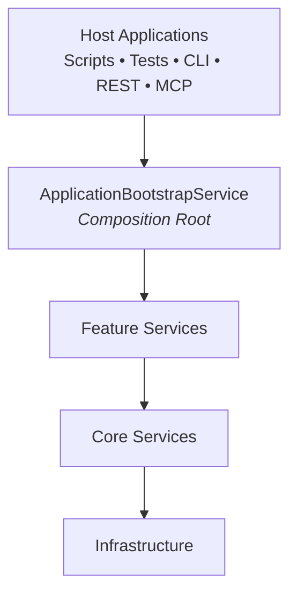

---

# Package Organization

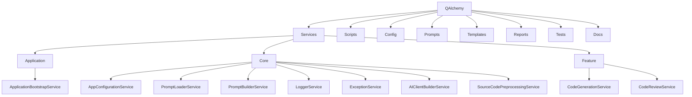

---

# Layered Architecture

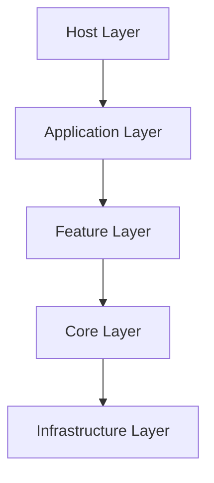

---

# Application Startup Lifecycle

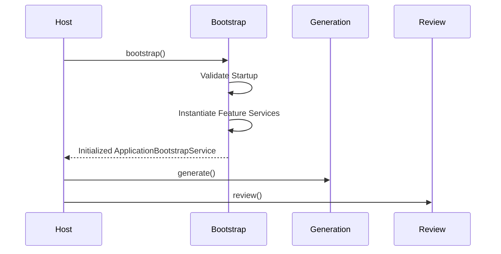

---

# Application Bootstrap

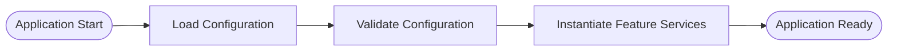

---

# Runtime Architecture

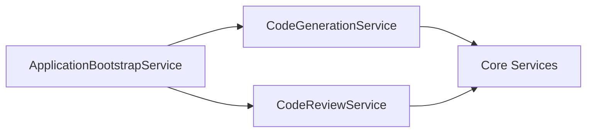

---

# Core Services

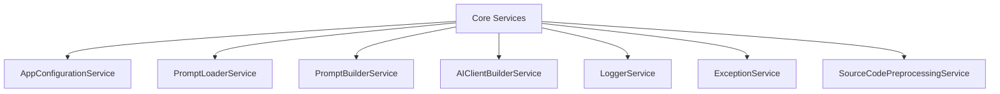

---

# Feature Services

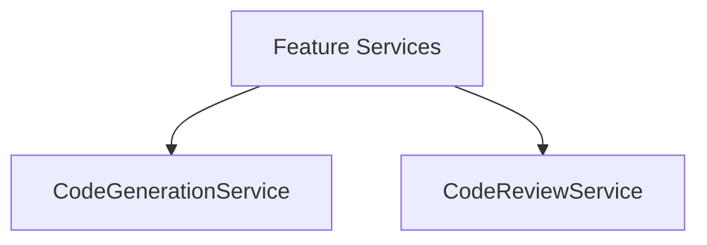

---

# Dependency Direction

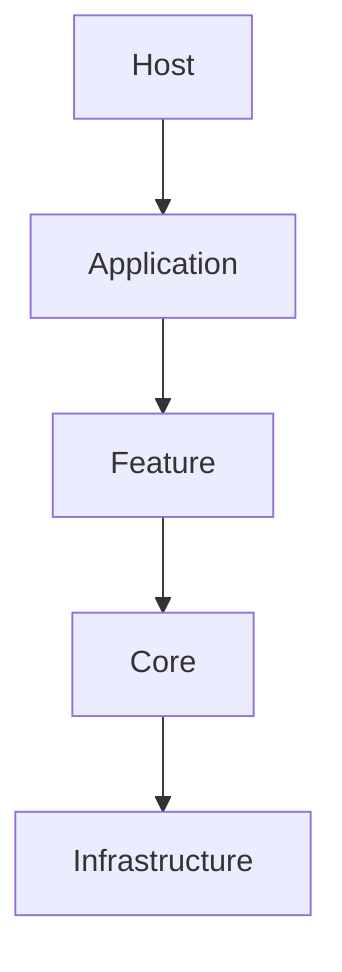

---

# Dependency Rules

| Allowed               | Not Allowed              |
| --------------------- | ------------------------ |
| Host → Application    | Feature → Application    |
| Application → Feature | Core → Application       |
| Feature → Core        | Core → Feature           |
| Core → Infrastructure | Infrastructure → Feature |

---

# Current Application Host

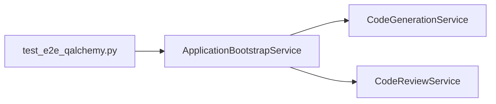

---

# Future Host Applications

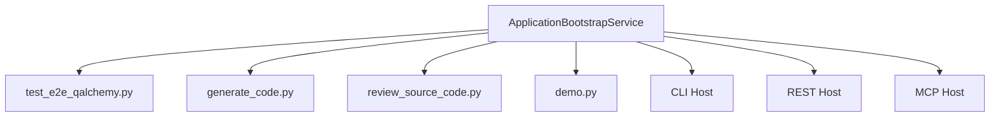

---

# Architecture Evolution

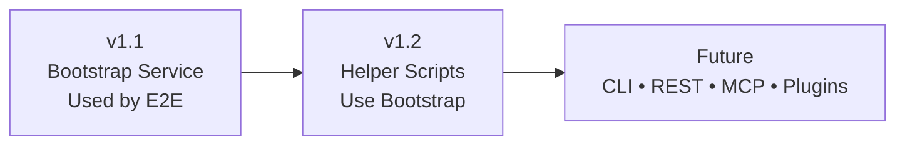

---

# Architectural Principles

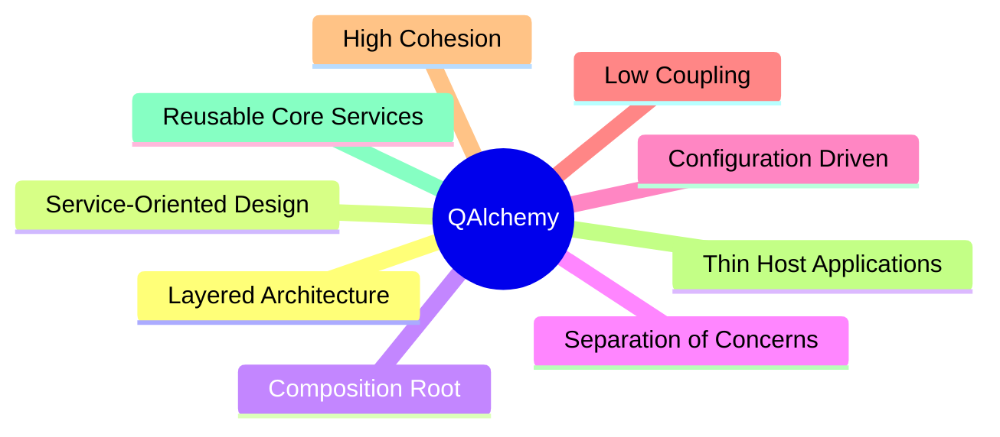

---

# Related Documents

* Architecture_Design.md
* ApplicationBootstrapService Blueprint
* Service Blueprints
* Design Specifications
* README.md
