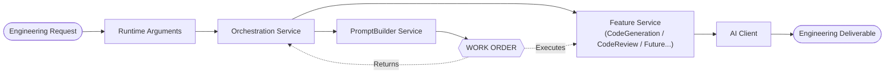
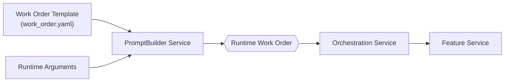

# QAlchemy Architecture (v1.2)

## Mission

QAlchemy is an AI Engineering Framework built around a single architectural principle:

> **Engineering work should flow through the system as a structured Work Order rather than as loosely coupled prompts or service-specific requests.**

The Work Order represents the canonical engineering contract exchanged between services. Every component exists to create, enrich, transport, execute, or observe that Work Order.

---

## Prime Objectives

1. **Work Order First** — Every engineering activity is represented by a Work Order.
2. **Single Engineering Contract** — Services exchange Work Orders, not prompts.
3. **Separation of Responsibilities** — Each service owns one responsibility.
4. **Composable Engineering** — Work Orders expand and contract without breaking consumers.
5. **Framework Before Features** — Infrastructure exists only to support the Engineering Flow.

---

## Engineering Flow

---

## Prime Directive

> **Everything in QAlchemy exists to create, enrich, transport, execute, or observe a Work Order.**

Every design decision should answer:

> **Does this improve the Engineering Flow?**

| Score | Meaning |
|--------|---------|
| +1 | Directly improves the Engineering Flow |
| 0 | Required infrastructure supporting the flow |
| -1 | Adds complexity without improving the flow |

---

## Work Order Lifecycle

---

## Runtime Request

The Runtime Request represents engineering intent before a Work Order exists.

Typical runtime arguments include:

- target
- requirements
- source_code
- language
- model_override
- context
- future runtime options

The Runtime Request is transient. The Work Order is the canonical engineering contract exchanged between services.

---

## Work Order Philosophy

The Work Order is:

- Not configuration.
- Not simply a YAML file.
- Not just a prompt.
- The executable engineering contract exchanged between services.

Typical sections include:

| Category | Purpose |
|----------|---------|
| Metadata | Routing and identity |
| Target | Intended Feature Service |
| System Prompt | AI behavior |
| Objective | Engineering objective |
| User Instructions | Runtime instructions |
| Context | Additional context |
| Artifacts | Standards and references |
| Constraints | Execution policies |
| Response Contract | Expected deliverable |
| Execution Options | Runtime behavior |

---

## Required vs Optional Fields

Required fields define the minimum executable contract.

Optional fields allow the Work Order to evolve without requiring Feature Service changes.

Consumers must:

- Consume required fields.
- Gracefully handle missing optional fields.
- Ignore unknown future fields.
- Never assume optional fields exist.

---

## Service Responsibilities

| Service | Responsibility |
|----------|----------------|
| ApplicationBootstrapService | Construct the application |
| AppConfigurationService | Configure application behavior |
| OrchestrationService | Route engineering work |
| PromptBuilderService | Build executable Work Orders |
| Feature Services | Execute Work Orders |
| AI Client | Deliver Work Orders to the AI provider |
| LoggerService | Observe the Engineering Flow |
| ExceptionHandlingService | Protect the Engineering Flow |

---

## Architectural Boundaries

### OrchestrationService

- Receives runtime requests.
- Selects the engineering workflow.
- Invokes PromptBuilderService.
- Receives the completed Work Order.
- Dispatches the Work Order to the correct Feature Service.

### PromptBuilderService

- Loads the Work Order template.
- Merges runtime arguments.
- Resolves engineering artifacts.
- Validates the engineering contract.
- Produces the executable Runtime Work Order.

### Feature Services

- Consume Work Orders.
- Never interpret YAML.
- Never build or modify Work Orders.
- Execute engineering work.

---

## Future Growth

All future capabilities should consume the same Work Order contract:

- Documentation Generation
- Test Generation
- Requirements Evaluation
- Architecture Review
- Security Review

---

## Architecture Decision Rule

Every proposal begins with one question:

> **Does this improve the Engineering Flow?**

If yes, classify it as **+1** or **0**.

If not, it is **-1** and should not become part of the core architecture.

---

> **QAlchemy is not a collection of AI services. It is an engineering workflow built around a single canonical Work Order that represents engineering intent from request to deliverable.**
